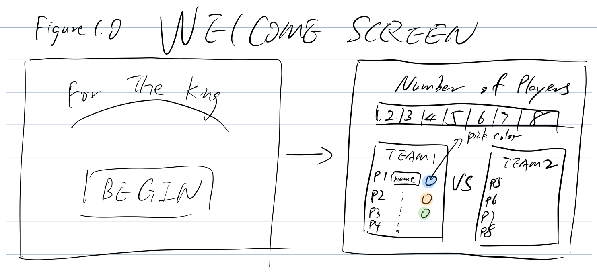
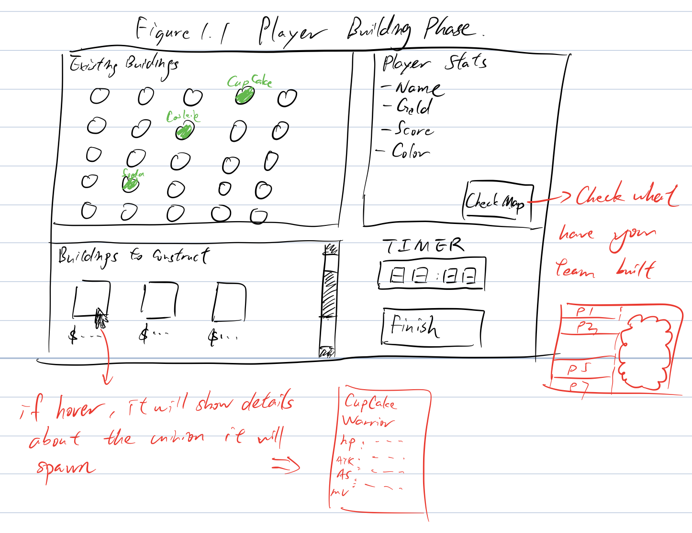

# Game Project: For the King

>@author Xingfan Xia, Russel Smith, Yitong Cheng
>@Project for CS257 Software Desgin
>@Professor Eric Alexander

### Game Design and Concepts

Our project is a PVP game called “For the King” with elements of turn-based games, RPG and tower defense games. This game is designed to provide a PVP experience with 2~8 players. Basically, the even number of players are divided into 2 teams fighting for their king. A particular round of the game will consist of 2 phases: building phase and fighting phase. 

In the building phase, each player receive gold from the system and they can choose what kind of buildings they want to build. Once every player is finished with their building selection, building phases ends and the fighting phase begins. At the start of the fight scene, buildings will spawn minions to fight. The fighting map is divided into 1~4 lanes depending on the number of players, each lane will have two players fighting each other. Each end of the lane will be the opposing player's base. Behind their base is a portal that teleports minions to fight for their Model.King. Between their bases will be a lane of blood and fire where minions fight to death. For example, player 1 and player 2 will be against each other, if player 1 have better army and wins the fight which usually happened in the middle of the lane; his minions will march forward until they arrive the portal behind player 2’s base and get teleported to their Model.King to fight the other Model.King. The game ends if one Model.King is defeated.

The income for players at each round is consisted of two parts: salary and war. At the start of each round, player get their salary to build buildings. During the fighting phase, the player is rewarded for every enemy minion they killed by 1/15 of the building cost that spawns it. In addition, the player get special bonus (probably 1/10 ~ ⅕ of the building cost)  from the Model.King for each minion that manages to survive to the portal and fight for their king. “Not only gold, but honor” says the Model.King.

There are 2 major categories of minions: melee or ranged; also each minion have a variety of attack type and armor type which counters each other. For example, a siege attack is effective against fort armor yet weak against other armor types. This provides a very tactical decision making experience for the players. The players not only need to figure out the their own army’s optimal positioning and ratio of melee and ranged minions but also to counter the opponent with effective strategies with his/her army composition in mind. 

If we have more time, we want to implement the following features as well to make the game even more tactical and fun:

- Add a technology system to the game to provide more choices for players. The player can use their gold not only to build barracks to get a stronger army but also recruit miners to get precious Arcane Crystal. The Arcane Crystal can be used in various ways:
  1. To recruit powerful mercenaries to join your army for one round whose greed for Arcane Crystal is beyond control.
  2. To learn powerful spells enabling the player to have direct impact on the battlefield. (You can even help your struggling teammates with this!)
  3. To have weapon or armor upgrades for their loyal minions so they can fight better.
  4. To empower their king by upgrading his stats like attack damage, armor, health regen, etc. (As usual, the Model.King will reward you with gold and honor!)
  5. To summon Model.King’s guard who were powerful units to protect the Model.King in danger. (Well, a Model.King always pays his debt)
- Add a Pantheon building where each player can recruit one and only one hero unit of their choice. They behaves almost same as usual minions but with powerful aura abilities or devastating spells.
- Add factions to the game, each player can choose their faction at the start of the game; each faction have unique minions, heroes and even special faction perks!

### Pieces to Implement:

As we’ll be using the Model-View-Controller design pattern, we’ll need each of those pieces:

- Our Model will hold all game state information - a large game class will hold all the information about the current game, including instance variables that hold lists of the players, the buildings that have been built, and the minions that have been spawned. Thus, our model will also need to hold the following:

  - A player class, keeping track of that player’s gold, score, and a list of buildings they have.
  - A building class, keeping track of that building’s position, with subclasses for each kind of building.
  - A minion class with subclasses for each kind of minion, with each subclass storing a unique behavior.
  - A Model.King class which stores all the data about the Model.King including his health, health regen, attack damage, etc. (It’s all about the Model.King right?)

- Our controller will primarily be divided into two parts: 

  One will hold the code that allows for the building mode, and one that runs the loop for the ‘battle’ mode. The controller will need to change which view is being used for each mode, and then have different handler functions for each mode.

  - During the build mode, the view will pass different mouse click information and key press information to the controller, which will interpret that information and pass it to the model as information about the creation of buildings and other options available in the build mode. 
  - During the battle mode, the controller will use time step handlers to run the behaviors of each building and each minion at the correct rate.
  - The controller for the battle mode is a priority over the controller for the build mode - we could theoretically initialize our buildings manually rather than using the build step, and thus will focus on that part of the controller first.

- Our view will also be split into two: one for the build mode and one for the battle mode. 

  - During the build mode, our view will show a smaller section of the map depending on the player, and will display various buttons giving the user options to create buildings. When those buttons are clicked, the view will inform our controller. 
  - During the battle mode, the view will show a map and all buildings, and will receive a list of the minions and their positions at each time step, and then display each of them. Similarly to our pieces of the controller, the view for the battle mode is a priority over the view for the build mode.

### Design Patterns

We will be using the MVC (Model-View-Controller) design pattern in the general structure of the program. This means that we will incorporate the Observer pattern (the view will be an observer of the controller) into our program. We will also be using the Strategy pattern as we develop different buildings and minions. 

### GUI Sketchups

- The screen on the left in Figure(1.0) is the startup screen of the game. As the user clicks on the “Begin” button, s/he will be taken to the screen on the right. Here the game will ask the user for the num)ber of players and their names in order to generate a new game. 

  

- The game goes by rounds. In each round, all the players start by constructing buildings in their bases one by one. Figure(1.1) shows the control panel for a player. As can be seen in Figure(1.1), by clicking “See View.Map”, the player will be able to view the existing buildings of their team on the map, but will not see those buildings of the enemy team. Once a player finishes constructing buildings for the round, s/he can click on “Finish” and the game will show the next player’s control panel. 

  

- Once all the players are done with constructing buildings for the round, the last person clicking “Finish” will take everyone to the map in fighting phase in Figure(1.2), where minions will be spawned automatically. The minions will march toward the enemy side and attack any enemies they encounter on the way. 

  	

- The game ends when one of the team kings is defeated. As the game ends, a score panel and an achievement panel will be shown to the user as in Figure(1.3). Here the user is provided with two choices, to re-play the game or to quit. The “Play Again” button takes the user back to the screen where they enter the number of players and player information and the “Exit” button terminates the game.

  

### Division of Labor

As we envision, the game will be consist of multiple pieces. 

- Xingfan will be in charge of designing and developing a variety of buildings and minions in the game. 	
  - We envision that the game will have two controllers, one for the build mode and the other for the fighting mode. Yitong and Russell will each be in charge of one of the two controllers. 
- Additionally, Yitong will develop the the view for the battle mode and Russell will be be building the model.

## Assets

### Shield Knight Minion

- Walking

  

- Attacking

  

  

- Walking in scene

  

- Fighting in scene

  